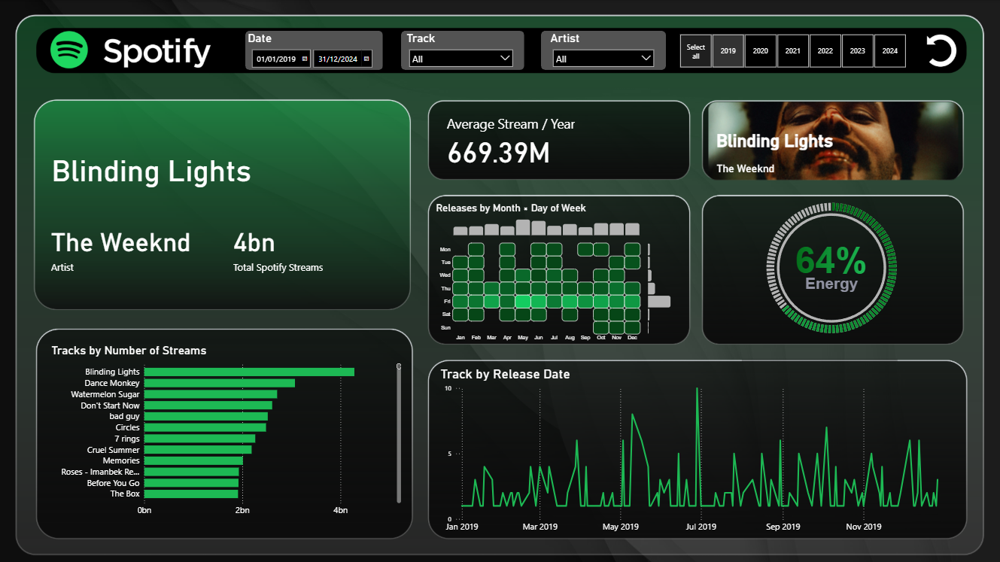

# 🎵 PowerBI-Spotify-Dashboard
Interactive Power BI dashboard analyzing Spotify streaming data (2019–2024). \
Download: [Spotify-PowerBI.pbit](Spotify-PowerBI.pbit?raw=1)

## 🎧 Spotify Streaming Dashboard  

An interactive Power BI dashboard analyzing **Spotify’s most streamed tracks and artists**. Built using Spotify API data and external sources.

### Dataset
This dashboard uses the **[Top Spotify Songs 2024 dataset](https://www.kaggle.com/code/nelgiriyewithana/an-introduction-to-top-spotify-songs-2024)** from Kaggle.  
The dataset includes track metadata, artist details, popularity scores, release years, and audio features from 2019–2024.  

### Dashboard Interactivity
- **Date slicer** → filter streams by custom date range  
- **Track slicer** → select specific songs to analyze  
- **Artist slicer** → drill down by artist  
- **Year selector** → toggle across multiple years (2019–2024)  
- **Reset button** → clear filters and return to full view  

### Features & Visuals
- KPI cards for **total streams** and **average streams per year**  
- Heatmap: releases by **Month × Day of Week** *(Deneb / Vega-Lite)*  
- Circular KPI gauge for **track energy** *(Deneb custom visual)*  
- Bar chart: **Top tracks by total streams**  
- Line chart: **Track popularity / releases over time**  
- Dynamic **album artwork tile** that updates with the current selection  

## Credits & Licenses

### Circular KPI Gauge (Deneb/Vega)
- **Source:** “Convert Vega/Deneb gauge to work in Power BI” by **davidebacci** & contributors — https://stackoverflow.com/questions/75881301/convert-vega-deneb-gauge-to-work-in-powerbi  
- **License:** **CC BY-SA 4.0** — https://creativecommons.org/licenses/by-sa/4.0/  
- **Changes (mine):**
  - Bound to my measure `_Percent_popularity_val` via `data('dataset')` and rounded value.
  - Spotify-style green gradient (`#036d19 → #1DB954`) and linear color scale for the foreground arc.
  - Center labels: large % value (font 70) and caption “Energy” (font 30).
  - Fixed canvas (width/height 350, padding 50), ring thickness via innerRadius offsets, arc padAngle.
  - Kept timer-based refresh so it respects current slicers.
- See `NOTICE-STACKOVERFLOW` for attribution details; this gauge spec is CC BY-SA 4.0.

### Heatmap with Bars (Deneb)
- **Base template:** PowerBI-tips / Deneb-Templates — *“heatmap with bars – red themed.json”*  
  https://github.com/PowerBI-tips/Deneb-Templates/blob/main/templates/heatmap%20with%20bars%20-%20red%20themed.json  
  *(Author in template metadata: Injae Park)*
- **Changes (mine):**
  - Mapped fields to my model: `Month`, `Day of Week` (Mon–Sun), and measure `_Track` (count).
  - Theme colors via `pbiColor(...)` and `pbiColorLinear`; removed legend.
  - Fixed month order (Jan→Dec) and weekday order (Mon→Sun); labels angle 0, ticks/domains hidden.
  - Adjusted layout for small tile: top bar `height: 30`, heatmap `step` sizes `25/30`, spacing 15.
  - Tooltips limited to Month / Day of Week / Track count.
- (Linked to original template rather than redistributing verbatim.)

> The Deneb gauge is adapted from Stack Overflow and is licensed **CC BY-SA 4.0**.  
> See `NOTICE-STACKOVERFLOW` for attribution and details.
